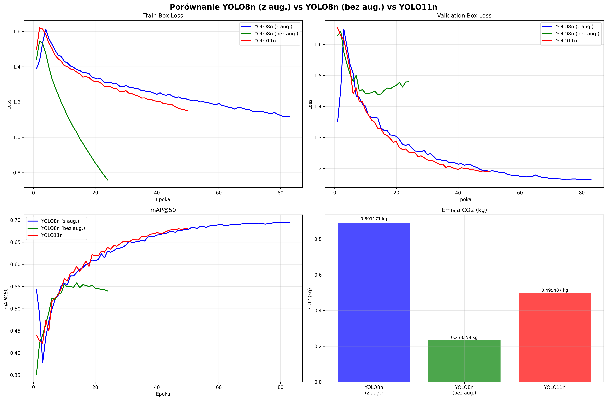
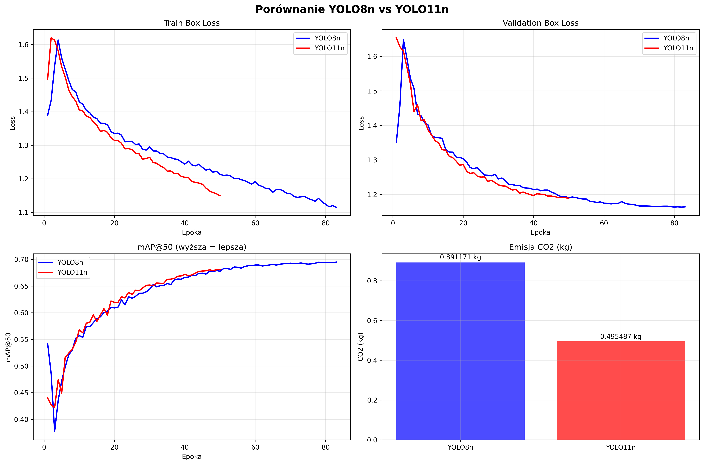
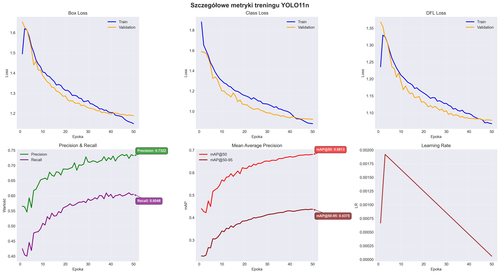
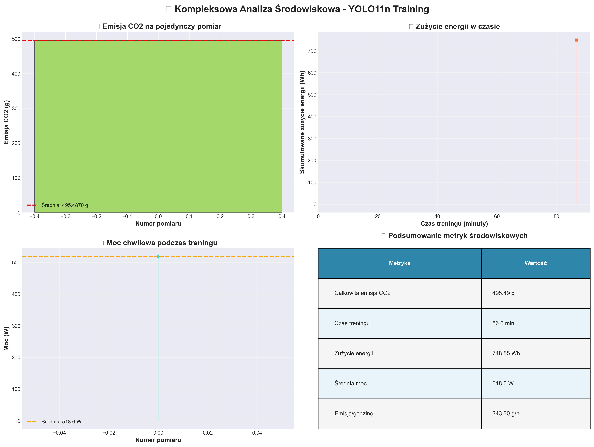
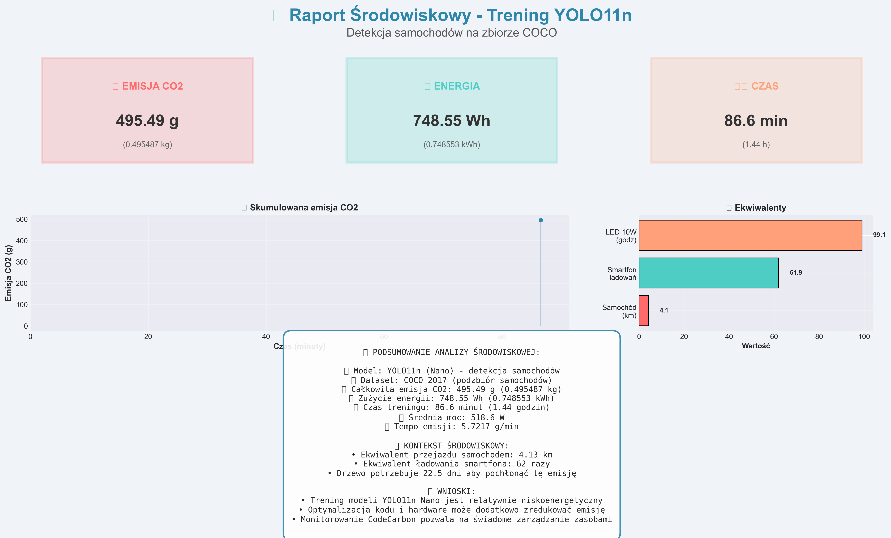
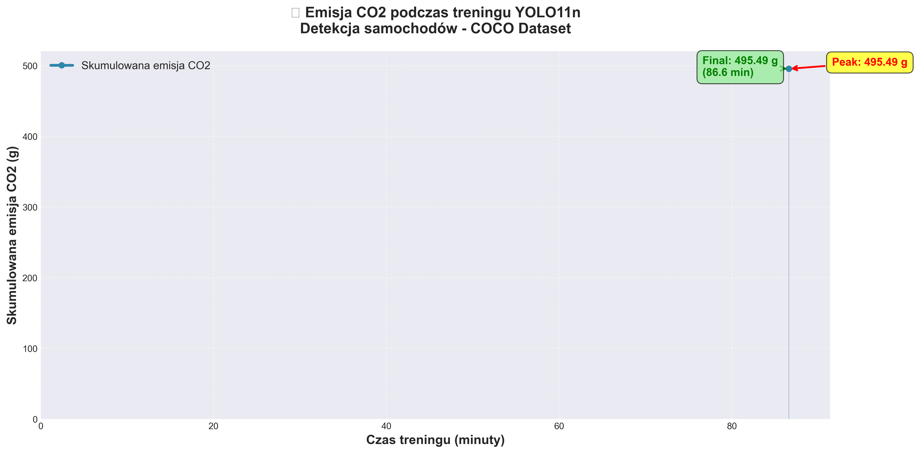
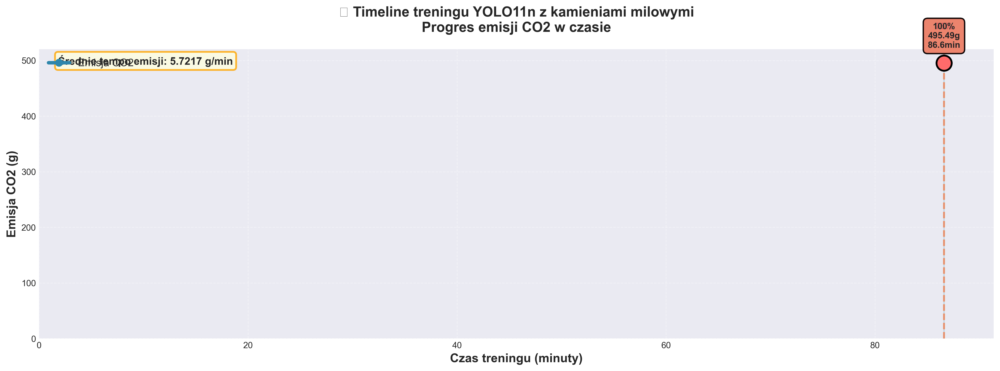
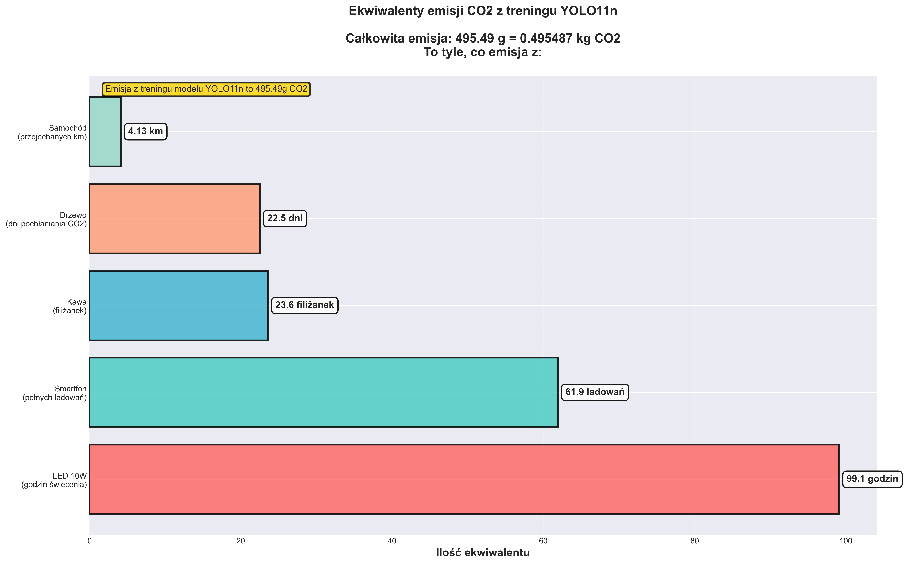
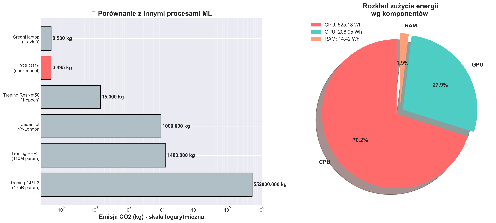

# YOLO Car Detection - Analiza Emisji CO2

Projekt porównujący wydajność i wpływ na środowisko różnych modeli YOLO do detekcji samochodów.

## 📋 Opis Projektu

Projekt wykorzystuje modele YOLO (You Only Look Once) do detekcji samochodów na obrazach z datasetu COCO. Głównym celem jest porównanie:
- **YOLOv8n** (z augmentacją danych)
- **YOLOv8n** (bez augmentacji danych)  
- **YOLO11n**

Dodatkowo projekt analizuje emisję CO2 generowaną podczas treningu modeli przy użyciu biblioteki **CodeCarbon**.


## 🎯 Funkcjonalności

- ✅ Przygotowanie datasetu COCO (kategoria: samochody)
- ✅ Trening modeli YOLO z różnymi konfiguracjami
- ✅ Pomiar emisji CO2 podczas treningu
- ✅ Porównanie metryk wydajności (mAP, Precision, Recall)
- ✅ Wizualizacja wyników i statystyk
- ✅ Eksport modeli do formatu TorchScript

## 📊 Struktura Projektu

```
wtum/
├── WTUMPROJ.ipynb          # Główny notebook z analizą
├── dataset.yaml            # Konfiguracja datasetu YOLO
├── .gitignore             # Pliki ignorowane przez git
└── results/               # Wyniki treningu i wizualizacje
    ├── emissions_*.png    # Wykresy emisji CO2
    ├── model_comparison_*.png  # Porównanie modeli
    ├── yolo11n_detailed_metrics.png
    ├── schemat_aplikacji_flowchart_poprawiony.png
    ├── model_comparison_metrics.csv
    ├── emissions_results.json
    ├── emissions_results_detailed.json
    └── emissions_results.txt
```

## 🚀 Instalacja

### Wymagania
- Python 3.8+
- CUDA (opcjonalnie, dla GPU)

### Instalacja zależności

```bash
pip install ultralytics
pip install codecarbon
pip install pycocotools
pip install torch torchvision
pip install matplotlib pandas
```

## 💻 Użycie

### 1. Przygotowanie Datasetu

Dataset COCO z kategorią "car" jest automatycznie pobierany i konwertowany do formatu YOLO:

```python
# Kod w notebooku pobiera obrazy z API COCO
# i konwertuje adnotacje do formatu YOLO
```

### 2. Trening Modelu

```python
from ultralytics import YOLO
from codecarbon import EmissionsTracker

# Inicjalizacja modelu
model = YOLO("yolov8n.pt")

# Trening z monitoringiem emisji
tracker = EmissionsTracker(project_name="yolo_detection")
tracker.start()

model.train(
    data='dataset.yaml',
    epochs=100,
    imgsz=640,
    batch=16,
    device='cuda'
)

emissions = tracker.stop()
```

### 3. Analiza Wyników

Wszystkie analizy i wizualizacje znajdują się w notebooku `WTUMPROJ.ipynb`. Folder `results/` zawiera:
- Wykresy porównawcze modeli
- Szczegółowe metryki wydajności
- Raporty emisji CO2
- Schemat aplikacji

## 📈 Kluczowe Metryki

Projekt analizuje następujące metryki:
- **mAP50** i **mAP50-95** - mean Average Precision
- **Precision** - dokładność detekcji
- **Recall** - czułość modelu
- **Emisja CO2** - wpływ środowiskowy treningu (kg CO2)
- **Czas treningu** - efektywność czasowa
- **Zużycie energii** - konsumpcja energii (kWh)

### Porównanie Modeli

Porównanie wydajności trzech konfiguracji modeli YOLO:





### Szczegółowe Metryki YOLO11n



## 🌍 Analiza Emisji CO2

Projekt wykorzystuje CodeCarbon do monitoringu:
- Całkowitej emisji CO2 podczas treningu
- Zużycia energii
- Ekwiwalentów środowiskowych (np. przejechane kilometry samochodem)
- Porównania wpływu różnych konfiguracji modeli

### Dashboard Emisji



### Raport Końcowy Emisji



### Timeline Emisji





### Ekwiwalenty Środowiskowe



### Benchmark



## 📝 Notatki

- Duże pliki (modele `.pt`, datasety) są ignorowane przez git - należy je wygenerować lokalnie
- Wyniki treningu zapisywane są w folderze `runs/` (ignorowany przez git)
- Przed treningiem zaleca się konfiguracja dataset.yaml zgodnie z lokalizacją danych

## 🔧 Wymagania Sprzętowe

- **Minimum**: CPU, 8GB RAM
- **Zalecane**: GPU NVIDIA z CUDA, 16GB RAM
- **Przestrzeń dyskowa**: ~5-10GB (dataset + modele)

## 📄 Licencja

Projekt edukacyjny - wykorzystuje otwarte datasety i biblioteki.

## 🤝 Autor

Projekt stworzony w ramach analizy wydajności modeli YOLO i ich wpływu na środowisko.

---

**Uwaga**: Aby odtworzyć wyniki, należy:
1. Pobrać dataset COCO (automatycznie przez kod)
2. Wytrenować modele (czas ~1-4h w zależności od sprzętu)
3. Uruchomić komórki analizy w notebooku

